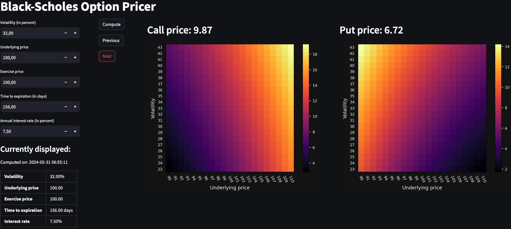
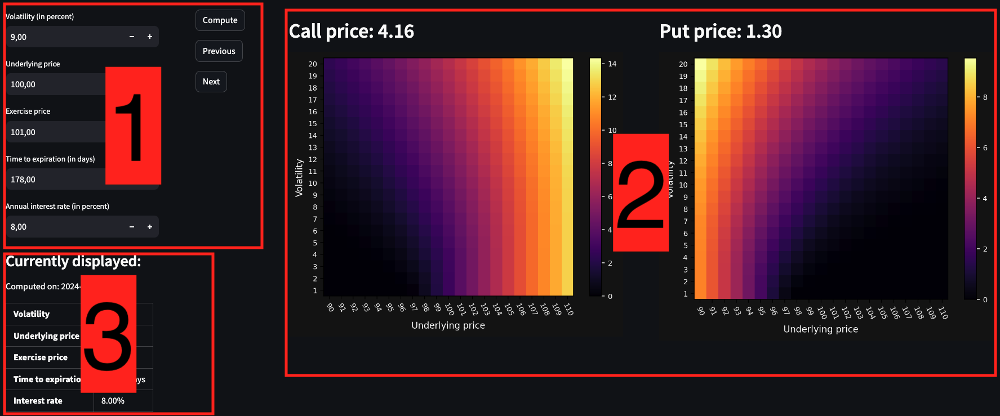

# Black-Scholes Option Pricer

# Introduction 
This project provides a tool for traders to compute option prices using the Black-Scholes model.
To support the analysis of the financial instrument, heatmaps display the effect of 
potential volatility and underlying price variations. The GUI uses the [Streamlit](https://streamlit.io/) 
Python framework. Finally, to facilitate parallel analysis, the different computations are stored in a MySQL 
database and are accessible through a navigation interface.

# Model
The value of an option represents the expected profit from owning the option. From the price distribution two components
are extracted:
- average value of all stock above the exercise price[^1]: the weighted average price at which the option would be executed 
- average payout from exercise of the option[^1]: computed from the probability the option would be in the money 

The difference between these two components is the expected profit from owning the option.

The **_Volatility_** is the standard deviation of the price distribution and characterizes the expected price movements 
on the market. Higher volatility reflects higher probability for high underlying prices and increases the value 
of an option.

The **_Interest rate_** affects the value of an option as the exercise price is the forward price and needs to be 
adjusted to reflect its present value using the **_Time to expiration_**. Higher interest rate increases (decreases) the 
price of a call (put) option, since carrying the stock is more expensive with high interest rate and holding cash is
more advantageous as more interest can be earned.

By fixing the interest rate and the volatility, it is possible to compute the option value. The project uses the 
original **_Black-Scholes model_** for options on a non-dividend-paying stock[^1]:

[^1]: Option volatility and pricing (2nd edition) - Sheldon Natenberg

$$\textbf{Call price} = S \thinspace N(d_1) - X \thinspace e^{-rt} \thinspace N(d_2) 
\quad \quad \quad 
\textbf{Put price} = X \thinspace  e^{-rt} \thinspace N(-d_2) - S \thinspace N(-d_1)$$

$$ \text{where} \quad\quad d_1 = \displaystyle\frac{ln\frac{S}{X}+\frac{\sigma ^2}{2}t}{\sigma \thinspace \sqrt{t}}   
\quad\quad\text{and}\quad\quad 
d_2 = d_1 - \sigma \thinspace \sqrt{t} $$

_S: underlying price  
X: exercise price  
t: time to expirations in years  
r: domestic interest rate  
&sigma;: annualized volatility in percent_

# How to set up and run the app

## Python
The project was developed using Python 3.12 and the versions of the different 
installed libraries are specified in the [requirements](requirements.txt) file.

## Setting-up the database

The application requires a locally hosted MySQL database named: **_Option_Pricer_DB_**.
Run the following command in MySQL to create the database.

    CREATE DATABASE Option_Pricer_DB;

## Setting Environment Variables

To access the database, the username and password needs to be recorded in environment variables. 

    export DB_USERNAME_OPTION_PRICER='your_mysql_username'
    export DB_PASSWORD_OPTION_PRICER='your_mysql_password'

## Running the Project

    streamlit run main.py

The model opens in the default web browser.

# Limitations of Streamlit
Streamlit framework triggers a complete run of the code for every interaction with the GUI and interrupts any 
previously running code. There is therefore no way to implement atomicity for every code execution. Locking mechanisms
which normally guarantee full execution of a portion of the code can in this framework be aborted at any moment 
by any new interaction with the GUI. Bugs have been observed when clicking repeatedly fast on the buttons,
resulting in variables maintaining the current state of the system to be corrupted. An acceptable practice is to wait 
a second between two button clicks not to corrupt the system.

# How to use it
## Interface

The GUI is divided in three parts. **1** is used to enter model inputs and to navigate through the
computed values. Any forbidden value triggers a message inviting the user to correct the given input. 
**2** displays the results of the model: prices of the put and call options and heatmaps
displaying the price variations of the options if volatility and underlying price deviate in the ranges +/-10.
**3** shows the inputs to the model corresponding to the displayed prices and heatmaps, guaranteeing 
certainty in the provided information.

## User controls
**_Compute_**: runs the model computation, stores the values in the database and displays them. In case 
the inputs have not been changed since the last computation, the values are not computed and the last computation
is loaded from the database. This prevents storing unnecessarily the same values.

**_Next_** (**_Previous_**): loads and displays the next (previous) model computation stored in the database.

