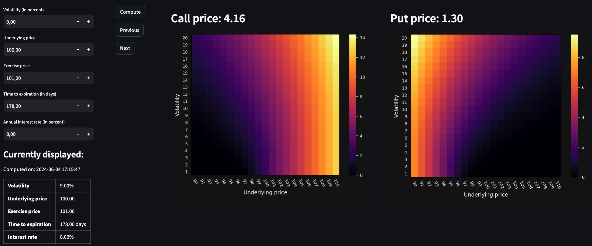

# Black-Scholes Option Pricer

## Introduction 
This project provides a tool for traders to compute option prices using the Black-Scholes model.
To support the analysis of the financial instrument, heatmaps display the effect of 
potential volatility and underlying price variations. The GUI is implemented using the Streamlit 
library. Finally, to facilitate parallel analysis, the different computations are stored in a MySQL 
database and are accessible through a navigation interface.

## Model
The model used for this project is the original Black-Scholes model for options on a non-dividend-paying 
stock[^1]:

[^1]: Option volatility and pricing (2nd edition) - Sheldon Natenberg

$$\textbf{Call price} = S \thinspace N(d_1) - X \thinspace e^{-rt} \thinspace N(d_2) 
\quad \quad \quad 
\textbf{Put price} = X \thinspace  e^{-rt} \thinspace N(-d_2) - S \thinspace N(-d_1)$$

$$ \text{where} \quad\quad d_1 = \displaystyle\frac{ln\frac{S}{X}+\frac{\sigma ^2}{2}t}{\sigma \thinspace \sqrt{t}}   
\quad\quad\text{and}\quad\quad 
d_2 = d_1 - \sigma \thinspace \sqrt{t} $$

S: underlying price  
X: exercise price  
t: time to expirations in years  
r: domestic interest rate  
&sigma;: annualized volatility in percent

## How to setup and run the app
The project was developed using Python 3.12 and the versions of the different 
installed libraries are specified in the requirements.txt file.

The application requires a locally hosted MySQL database named: Option_Pricer_DB.
Run the following command in MySQL to create the database.

'''sql
CREATE DATABASE Option_Pricer_DB
'''

To access the database, the username and password needs to be recorded in environment variables. 

'''sh
export DB_USERNAME_OPTION_PRICER='your_mysql_username'
export DB_PASSWORD_OPTION_PRICER='your_mysql_password'
'''

To run the project, execute teh following line of code in the terminal.

'''sh
streamlit run main.py
'''

## Language, tools and limitations

## How to use it

